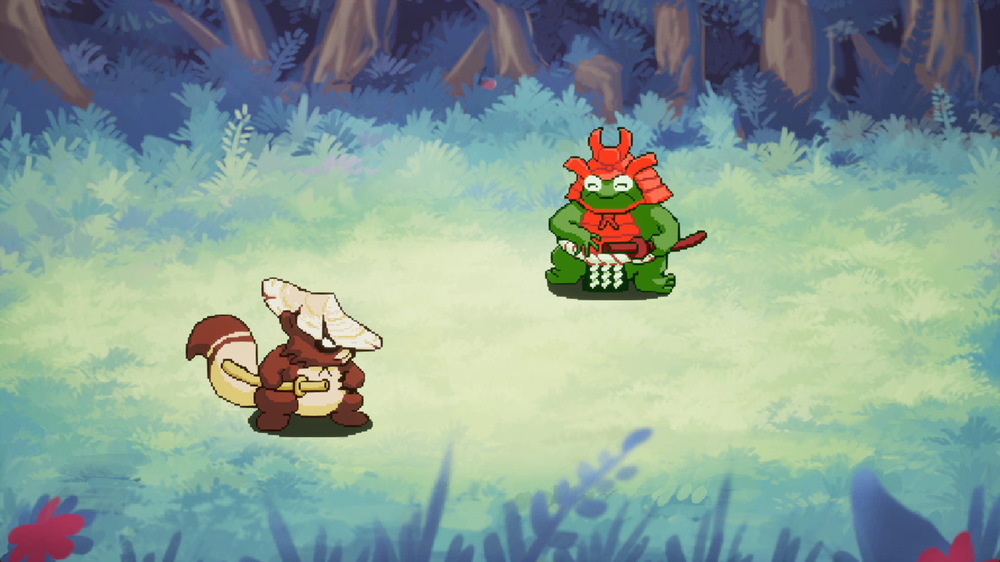

# Quick Draw Project README

## Course Link
This project is associated with "The Ultimate Unreal Engine 2D Game Development Course" available on Udemy. You can access the course [here](https://www.udemy.com/course/unreal-2d-course/).

## Key Learning Points
- **Understanding Sprites:** Through this project, you will gain a better grasp of working with Sprites in Unreal Engine, which are crucial for 2D game development.
- **Blueprints Only:** The entire project is developed using Unreal Engine's visual scripting system, Blueprints, making it accessible to programmers and non-programmers alike.

## Game Mechanics
- The game involves a simple yet engaging mechanic where you need to press the spacebar rapidly when an exclamation mark appears on the screen.

## Platform Compatibility
- This project has been developed for and tested on **Windows only**. Compatibility with other operating systems has not been established.

## Exiting the Game
- If you need to exit the game at any point, you can do so easily by pressing **Alt + F4**.

Thank you for choosing to explore game development through this project. We hope it serves as a valuable tool in your learning journey. Happy developing!